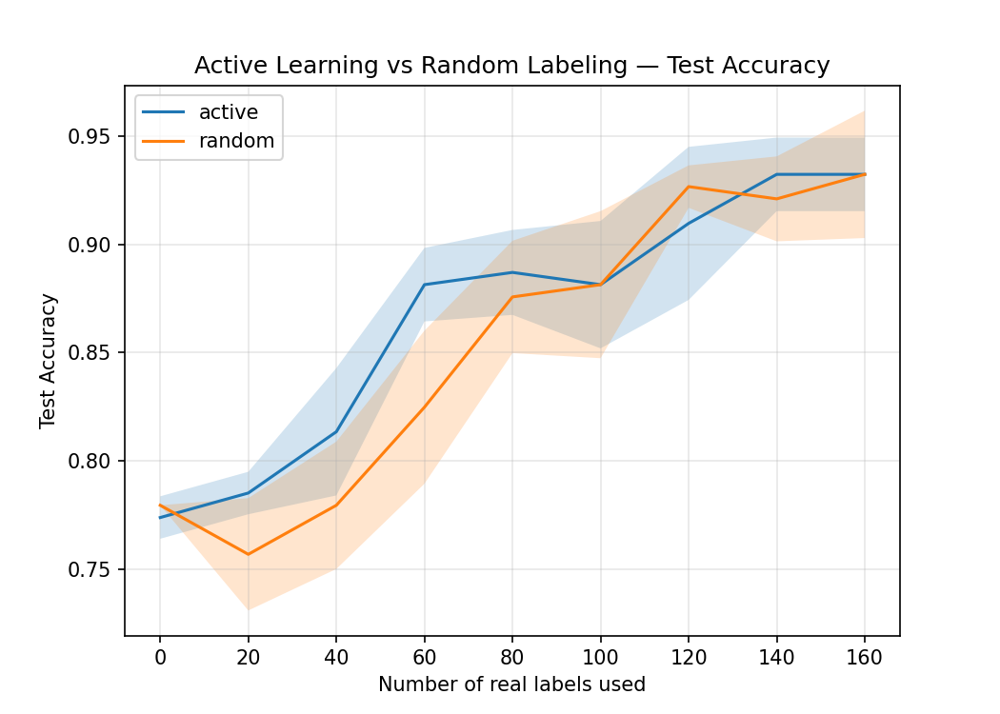
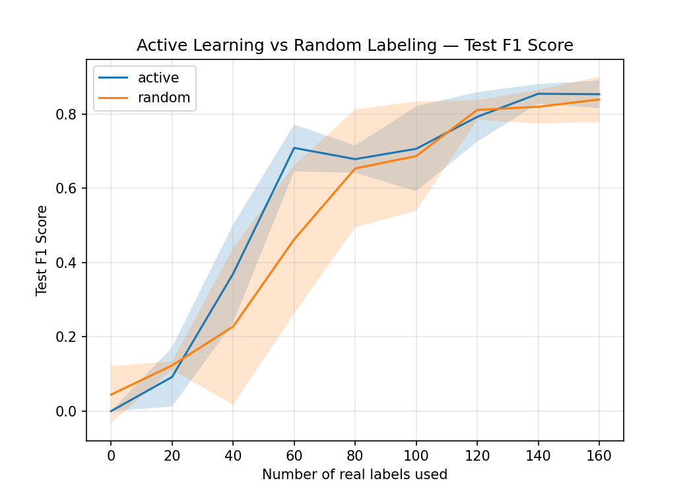

# Active Learning for Industrial Bottle Defect Detection

> Reducing manual labeling costs by combining synthetic data generation with active learning.

## Why

High-quality labeled defect images are expensive because manufacturing defects are both rare and require expert inspection. Most machine learning models assume large labeled datasets, making them difficult to deploy in real production environments.

This project explores whether combining synthetic defect generation with active learning can significantly reduce the amount of real labeled data required while maintaining competitive classification performance.

## What I Built

The system simulates a realistic industrial inspection workflow.

- Generate synthetic bottle defects from clean images.
- Train an initial defect classifier without any real defect labels.
- Iteratively identify the most informative unlabeled images for annotation.
- Compare **active learning** against **random sampling** under the same labeling budget.
- Measure how quickly each strategy improves model performance.

---

## Results

### Bootstrap Model (0 Real Labels)

The initial model was trained **only on synthetic defects**, without using any real labeled training images.

| Metric | Score |
|--------|------:|
| Accuracy | **0.729** |
| Precision | **0.429** |
| Recall | **0.692** |
| F1 Score | **0.529** |

Although the synthetic data provides a reasonable starting point, performance is limited due to the domain gap between synthetic and real defects.

---

### Final Performance

After progressively incorporating real labeled images:

| Strategy | Accuracy | F1 Score |
|----------|----------:|----------:|
| Active Learning | **0.932** | **0.850** |
| Random Sampling | **0.932** | **0.830** |

Both approaches substantially improved over the bootstrap model, while **active learning consistently achieved better performance than random sampling at every labeling checkpoint**, indicating that selecting uncertain samples provides a more efficient use of labeling effort.

More importantly, by combining active learning with synthetic defect generation, the model reached nearly 90% accuracy using only 50% of the real labeled data, highlighting the effectiveness of reducing annotation requirements while maintaining strong performance.
---

### Accuracy



---

### F1 Score



---

## Engineering Highlights

- Built procedural generators for scratches, cracks, scuffs, and blob defects.
- Implemented uncertainty-based active learning for iterative sample selection.
- Addressed severe class imbalance using weighted random sampling.
- Benchmarked active learning against random sampling across multiple random seeds.
- Automated experiment tracking and visualization.

## What I Learned

This project showed me that improving a machine learning system isn't just about choosing a better model. Benchmarking active learning against random sampling was essential to verify that the added complexity actually improved labeling efficiency, rather than simply assuming it would.

I also found that the quality of synthetic data depends heavily on human design. I spent a significant amount of time refining scratch, crack, scuff, and blob generators to produce realistic defects, and learned that carefully engineered synthetic data often has a greater impact on downstream performance than changing the classifier itself.

## Architecture

Clean Images
      │
      ▼
Synthetic Defect Generator
      │
      ▼
Bootstrap Training
      │
      ▼
Unlabeled Real Pool
      │
      ▼
Uncertainty Sampling
      │
      ▼
Reveal True Labels
      │
      ▼
Retraining
      │
      ▼
Evaluation

## Methodology

1. Create train/pool/test splits.
2. Generate synthetic defects from clean bottle images.
3. Train a bootstrap model using only synthetic defects.
4. Evaluate on real test images.
5. Repeat:
   - Predict probabilities on the unlabeled pool.
   - Select a batch of images:
     - uncertainty sampling (active learning), or
     - random sampling.
   - Reveal their labels.
   - Continue training with the expanded labeled dataset.
6. Compare both strategies throughout the labeling process.

---

## Model

- **Architecture:** ResNet-18
- **Transfer Learning:** ImageNet pretrained weights
- **Loss:** CrossEntropyLoss
- **Optimizer:** Adam
- **Input Resolution:** 224 × 224

---

## Dataset

The project uses the **Bottle** category from the MVTec Anomaly Detection dataset.

Training begins using synthetic defects generated from clean bottle images, while evaluation is performed exclusively on real defect images.

---

## Running the Project

The easiest way to reproduce the project is with the notebook:

```
notebooks/defect_detector.ipynb
```

The notebook walks through:

1. Dataset preparation
2. Synthetic defect generation
3. Bootstrap training
4. Active learning experiment
5. Evaluation
6. Result visualization

---

## Future Improvements

- More realistic synthetic defect generation
- Additional uncertainty sampling strategies (entropy, margin sampling)
- Fine-tuning larger pretrained vision models
- Multi-class defect classification
- Pixel-level defect localization using segmentation models
- Evaluation on additional MVTec object categories

---

## Technologies

- Python
- PyTorch
- Torchvision
- OpenCV
- NumPy
- Pandas
- Matplotlib
- scikit-learn